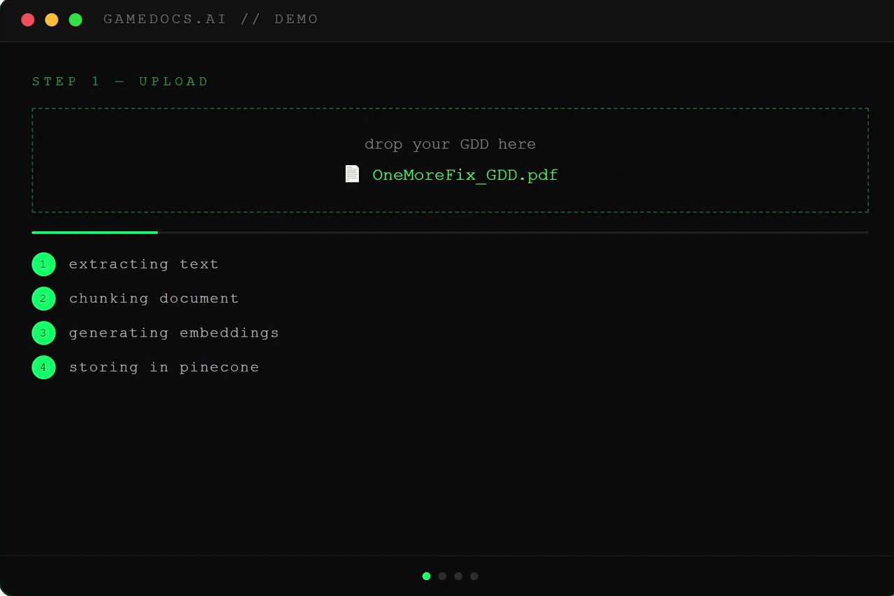

# 🧠 GameDocs AI

> Ask your game's brain, not Google.

GameDocs AI is a **RAG (Retrieval-Augmented Generation)** system built for game developers. Upload your GDD, changelogs, and design notes — then ask questions and get answers grounded in your actual documents, with source citations.

---



## Why This Exists

Sending your entire GDD to an LLM every time you have a question is slow, expensive, and breaks above a certain document size. GameDocs AI solves this with a proper RAG pipeline:

- **Unlimited document size** — only relevant chunks are sent to the LLM, not the whole doc
- **Persistent knowledge base** — index once, query forever
- **Source citations** — every answer tells you exactly which document and section it came from
- **Multi-document support** — query across your entire design library simultaneously
- **Grounded answers** — the model won't speculate beyond what your documents say

---

## Tech Stack

| Layer | Tool |
|---|---|
| Framework | Next.js 14 (App Router, TypeScript) |
| LLM | Anthropic Claude (claude-sonnet-4-6) |
| Embeddings | Google Gemini (gemini-embedding-001, 3072 dims) |
| Vector DB | Pinecone (cosine similarity) |
| File Parsing | unpdf, mammoth (PDF, DOCX, MD, TXT) |
| Deployment | Vercel |

---

## Architecture
User uploads document (PDF / DOCX / MD / TXT)
↓
Text extracted → chunked (500 tokens, 50 overlap)
↓
Gemini embeddings → 3072-dimensional vectors
↓
Vectors upserted to Pinecone index
↓
User asks a question
↓
Question embedded → similarity search → top 5 chunks retrieved
↓
Claude receives: [system prompt + retrieved chunks + question]
↓
Answer returned with source citations + similarity scores

---

## How RAG Differs From a Direct LLM Call

| | Direct LLM Call | GameDocs AI (RAG) |
|---|---|---|
| Document size limit | ~200k tokens max | Unlimited |
| Cost per query | Re-sends entire doc | Sends only 5 relevant chunks |
| Persistence | Re-upload every session | Index once, query forever |
| Source tracking | None | Cites exact doc + score |
| Multi-doc support | Manual, messy | Automatic |

---

## Running Locally

```bash
git clone https://github.com/YOUR_USERNAME/gamedocs-ai.git
cd gamedocs-ai
npm install
```

Create `.env.local`:

```env
PINECONE_API_KEY=your_key
PINECONE_INDEX=gamedocs
GEMINI_API_KEY=your_key
ANTHROPIC_API_KEY=your_key
DEMO_PASSWORD=your_password
NEXT_PUBLIC_DEMO_PASSWORD=your_password
```

```bash
npm run dev
```

Open [http://localhost:3000](http://localhost:3000).

---

## Usage

1. Enter the demo password
2. Click **+ UPLOAD DOC** — supports PDF, DOCX, MD, TXT
3. Wait for indexing confirmation (shows chunk count)
4. Ask any question about your uploaded documents
5. Answers include source citations and similarity scores

---

## Project Structure
app/
api/
ingest/route.ts   ← upload + embed + store in Pinecone
query/route.ts    ← RAG query + Claude answer
page.tsx            ← UI
lib/
pinecone.ts         ← Pinecone client
embeddings.ts       ← Gemini embedding calls
extract.ts          ← PDF/DOCX/MD/TXT text extraction
chunker.ts          ← text chunking logic
middleware.ts         ← demo password protection

---

## Built By

**Raheeb Ahmad** — Unity Engineer & AI/ML enthusiast
- [LinkedIn](https://linkedin.com/in/raheeb-ahmad-48205a21a)
- [GitHub](https://github.com/raheeb-ahmad)